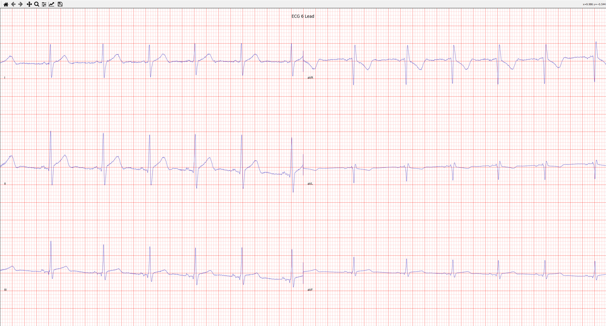

# Systolic
The code for the STM32 microcontroller in my ultra-low-cost electrocardiogram (ECG): Systolic

## What is Systolic?
Systolic is a project I have been working on for a couple months. It is an ultra-low-cost ECG which one day I hope can be used in developing countries. Systolic is very compact, and only requires a host device (e.g. a laptop). On the host device, a [program]( https://github.com/OskarCodes/SystolicHost) I made runs and allows for the configuration of sampling settings, starting/stopping sampling, and finally, the parsing of results.

## What are the results like?
Take a look, they're awesome, in my opinion!



## Setup
```shell
git clone https://github.com/OskarCodes/SystolicECG.git
cd SystolicECG/
```
And you are done! The project can then be opened in your IDE of choice.

## Contributing
I immensely appreciate any contribution to this project, no matter the size. Please feel free to make a pull request! If you have any questions, please do not hesitate to reach out.

## Licensing
This project is licensed under the GPL-3.0 license. I chose this because I want all changes to Systolic and supporting software, no matter who by, to be accessible to everyone.
